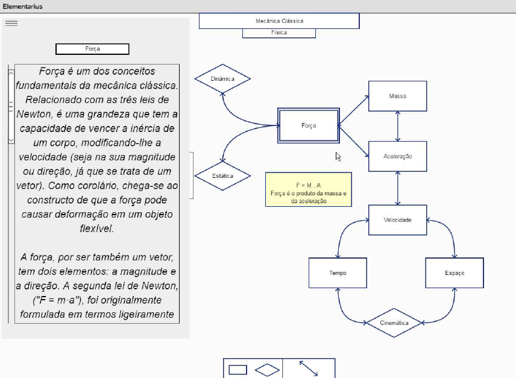

#Elementarium
Elementarium é um aplicativo web de anotações especializado cujo foco principal é dar a liberdade de expressar o relacionamento entre cada uma de suas anotações de forma 
livre mas deliberada. Em essência, Elementarium dá as ferramentas para que você estruture suas anotações em grafos conectados, permitindo que você construa um mapa 
intuitivo para suas informações da forma que quiser para, além de anotar aquilo que lhe for importante, possa analisar exatamente como anotações de diversos tipos 
podem se conectar.

##Capacidades esperadas

*Armazenamento de arquivos Como o aplicativo será desenvolvido para usos individuais, os arquivos serão armazenados na própria máquina de seu usuário. 
*Anotações: Existirão três tipos de anotações: 
	*Tópico, que contém um tı́tulo para sua visibilidade e toda a anotação contida neste; 
	*Mapa, um acesso a um novo mapa contido no mapa original; 
	*Adesivo, uma pequena anotação que deverá conter apenas algumas linhas de texto e um tı́tulo para sua identificação. 
*Organização em grafos: As anotações devem ser posicionadas em um grafo e devem ser capazes de serem visualizadas neste, mostrando suas conexões, tı́tulos e outras informações pertinentes. Deve-se também ser capaz de reorganizar e reconectar qualquer uma das anotações livremente a qualquer momento em sua visualização e criação

